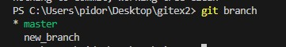
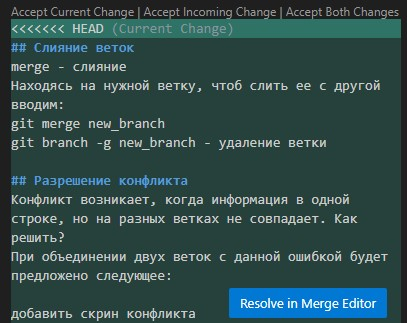

#Инструкция по GIT
## Проверка наличия установленного git
В терминале выполняем команду git --version. Если Git установлен, появится версия git

## Настройка GIT
Для представления вводим две команды:
git config --global user.email "something@email.com"
git config --global user.name "псевдоним"

## Инициализация репозитория 
Чтоб запустить начало команды, введите git init.
Далее проверим статус файла сохренений с помощью git status

## Сохранение изменений в файле 
Чтоб включить файл в сохранения, примените команду git add 
Чтоб создать новый файл, используйте git commit -m
Команда git commit -am объединяет две вышеупомянутые команды

## Перемещение между сохранениями 
git log открывает список коммитов
Переходите между коммитами с помощью git checkout 
Вернутся к исходному коммиту можно с помощью git checkout master

## Добавление картинок и игнор файлов
Чтобы добавить картнку:

Далее создайте папку .gitignore и поместите туда расширение, которое хотите заблокировать:
*png
*jpg и так далее
Свяжите папки между собой: git add .gitignore

## Ветвление
branch - ветка
git log --graph - открыть все изменения веток
git branch - выводит все ветви файла
git branch new_branch - создает новую ветку
git checkout new_branch - переход на новую ветку
git checkout master - переход на основную ветку

## Слияние веток
merge - слияние
Находясь на нужной ветку, чтоб слить ее с другой вводим:
git merge new_branch
git branch -g new_branch - удаление ветки

## Разрешение конфликта
Конфликт возникает, когда информация в одной строке, но на разных ветках не совпадает. Как решить? 

При объединении двух веток с данной ошибкой будет предложено следующее: 

Где:
Current Change - Оставить текущую версию.
Incoming Change - Заменить на другую версию.
Both Change - Объеденить обе.
